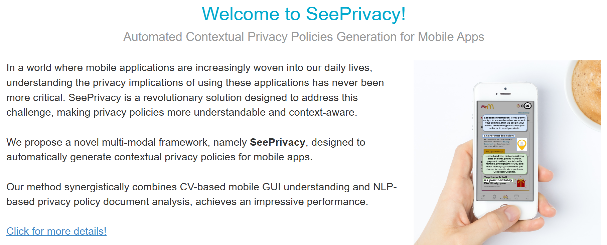

# Cpp4App.github.io

In this project, we propose a novel multi-modal framework, namely **SeePrivacy**, designed to automatically generate contextual privacy policies for mobile apps.

The showcase website of our **SeePrivacy**: https://cpp4app.github.io/index.html



Welcome to cite us:

```
@misc{pan2023seeprivacy,
      title={SeePrivacy: Automated Contextual Privacy Policy Generation for Mobile Applications}, 
      author={Shidong Pan and Zhen Tao and Thong Hoang and Dawen Zhang and Zhenchang Xing and Xiwei Xu and Mark Staples and David Lo},
      year={2023},
      eprint={2307.01691},
      archivePrefix={arXiv},
      primaryClass={cs.CR}
}
```

The template of our demostration website is taken from https://github.com/learning-zone/website-templates/tree/master.

The images of our demostration website are taken from https://unsplash.com/ , https://pixabay.com/ and https://icons8.com/
